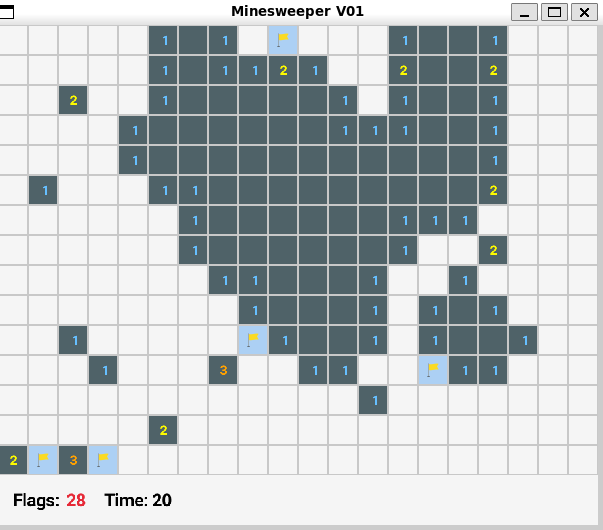
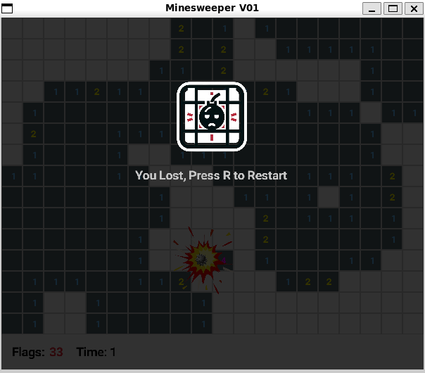

# Minesweeper

Simple minesweeper learning project.




## Dependencies

- [Raylib](https://www.raylib.com/)


Build:
```bash
chmod +x build.sh  && ./build.sh
```

Run:

```bash
./minesweeper
```

